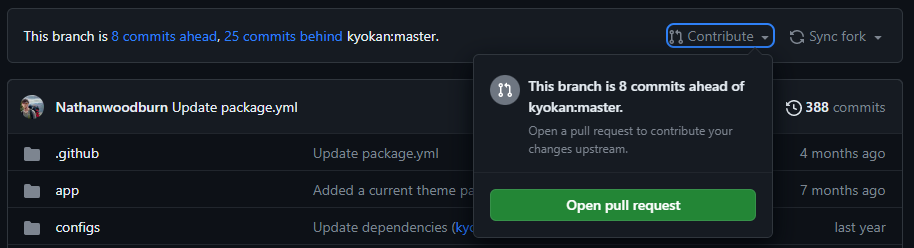

## Name:
# bb-week1
Feel free to contact me (Nathan) on:
1. [Discord](https://boysbrigade.au/discord) (Also has Isaac)
2. [Email](mailto:bb@nathan.woodburn.au)

## What you need to do this week
### Task 1
Create a Github account if you don't already have one.  

To create a Github account:
1. Go to https://github.com
2. Click the `Sign Up` button in the top right corner
3. Enter your details and create an account

### Task 2
1. Fork this repository by clicking the `Fork` button in the top right corner of this page.
2. Edit this file by putting your name to the name field (just first name is fine)
3. Commit your changes and use a sensible commit message (e.g. "Added name", not "Did an update")

### Task 3
1. Create a new file in this repository called `hello.txt`
2. Add some text to the file
3. Commit your changes

### Optional task
Create a Pull Request to merge your changes into this repository.
1. Click the Contribute and then Open Pull Request
   
2. Write a sensible title and description for your PR
3. Click Create Pull Request